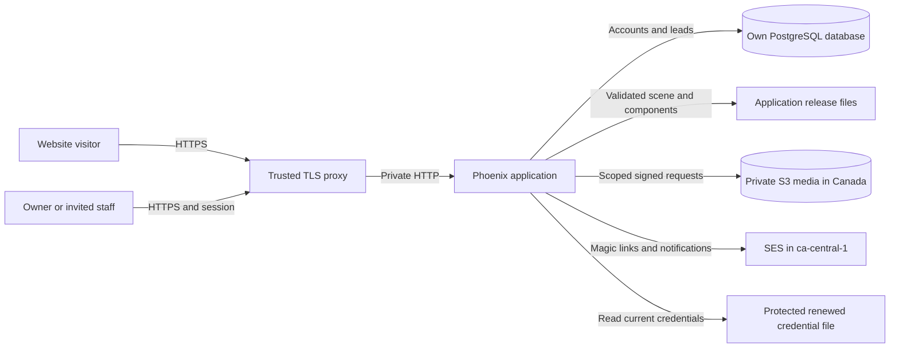
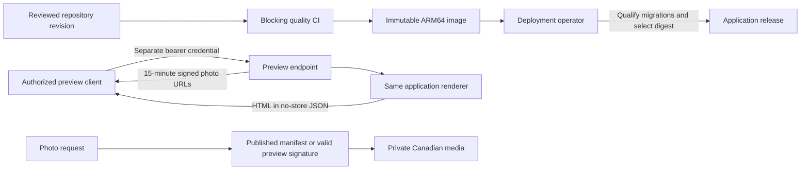

# Architecture

The application is a conventional Phoenix release with its own PostgreSQL
database. It imports no management application at build time or runtime.
External infrastructure supplies TLS termination, private storage, mail, and
runtime credentials.

## How the systems fit together

Bedrock constructs and updates the business's source repository. Its building
identity is separate from this application's owner and staff identities.
The customer application owns business behavior, staff access, and records.

Optional managed hosting uses Roost to operate the approved image, database,
and scoped runtime credentials. Bedrock and Roost are separate management
systems. The customer application imports neither system's code.

| Responsibility | Managed hosting | Self-hosting |
| --- | --- | --- |
| Source and business behavior | Customer repository, with Bedrock managing requested changes | Customer repository, maintained by the chosen team |
| Runtime and database | Roost operates the approved release and its infrastructure | The chosen operator manages infrastructure and releases |
| Staff identity and business records | This application's accounts and database | This application's accounts and database |
| Credentials and recovery | Hosting operator provisions access and qualifies recovery | The chosen operator provisions access and qualifies recovery |

These are infrastructure and maintenance relationships. Leaving managed hosting
requires a checked infrastructure and data transfer, not management application
modules added to the business system.

## Request and data flow

Public browser routes use CSRF protection and browser security headers.
Staff LiveViews require the application's authenticated scope. Context functions
check staff or owner permissions. Owner revocation invalidates tokens and
broadcasts session disconnection.

`Shop.Website` checks scene versions, model hashes, graph limits, component
registrations, and validation results before rendering. HEEx escapes dynamic
text. Native components are explicit application code; scene JSON cannot load
arbitrary modules or execute expressions as Elixir.

## Publication and preview boundaries

An image build does not restart the application. Source identity, image digest,
migration results, and live readiness are separate deployment evidence.
CI can publish an image after checks pass; it has no runtime restart step.

The preview endpoint has a separate machine credential and no staff browser
session. It renders without persisting scene changes. Signed photo links are
bound to the photo and variant. Their holders can access the corresponding
photo until expiry, so clients must keep preview output private.

## Trust assumptions and limits

- Only configured proxy peers may supply the visitor address used by rate
  limits.
- HTTPS redirect rewriting trusts the TLS edge. Keep the application port
  private.
- Credential paths come from deployment configuration, not request parameters.
- The operator protects database credentials and the session-signing secret.
- Business records stay in this database; no shared management database is
  needed.
- Rate-limit counters are local to one node and reset on restart.

Source references: [router](../lib/shop_web/router.ex),
[staff authorization](../lib/shop/accounts/staff.ex),
[renderer](../lib/shop/website.ex),
[preview controller](../lib/shop_web/controllers/website_preview_controller.ex),
[media controller](../lib/shop_web/controllers/media_controller.ex), and
[runtime configuration](../config/runtime.exs).
